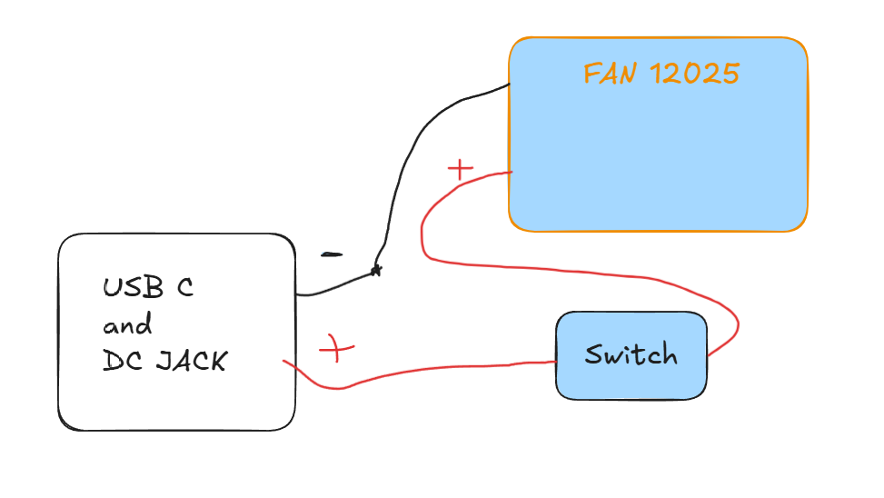

# fume extractor

a simple solder fume extractor built around a 12025 fan and a 10mm carbon filter.

no overthinking. just airflow, filtration, and basic control.

---

## what this is

a desk fume extractor for:
- pcb soldering
- flux smoke

pulls air through a carbon layer using a 120mm fan and pushes it out the back.

---

## system overview

usb-c pd / dc jack
↓
12v rail
↓
12025 fan
↓
carbon filter (10mm)
↓
clean exhaust

---

## parts list (BOM)

| component | specification | qty | approx price (₹) | notes | link |
|-----------|--------------|-----|------------------|------|------|
| axial fan | 120x120x25mm 12v dc fan (12025) | 1 | 310 | main suction fan | https://www.amazon.in/gp/product/B0BC8MDR7X/ref=sw_img_1?smid=AJ6SIZC8YQDZX&psc=1 |
| carbon filter | 10mm activated carbon sheet | 1 | 260 | smoke filtration layer | https://www.amazon.in/Activated-Carbon-Filter-Pad-130x130x10mm/dp/B0F9LQ7T6R |
| usb-c pd trigger | 12v pd negotiation module | 1 | 120 | usb-c power input | https://robu.in/product/pdc004-pd-pd-decoy-module-12v/ |
| dc jack | 5.5mm barrel jack socket | 1 | 25 | backup power input | https://robu.in/product/2-1x5-5mm-dc-power-jack-dc-socket-panel-mount/ |

---

## power system

two input options:

### usb-c pd
- 12v trigger module
- works with any decent pd charger (36w+ recommended)

### dc jack
- direct 12v input
- backup / bench supply option

both feed into a shared 12v rail.

---

---

## airflow design

important part of the build:

- fan is placed AFTER carbon filter (pull configuration)
- air is drawn through filter instead of pushed into it
- intake area should be wide and not restricted

---

## filter notes

- 10mm carbon layer is enough for solder fumes
- thicker filter reduces suction a lot
- replace filter when it starts smelling or airflow drops

---

## wiring (simple)

---

mount fan rigidly to avoid vibration noise

---

## what this can and can’t do

### works for:
- solder smoke
- flux fumes
- light electronics work

### not for:
- heavy industrial fumes
- chemical lab extraction
- enclosed toxic gas environments

---

---

## closing

built to sit on a desk and just remove smoke while working.

nothing more.
nothing less.

# Fume-extractor
